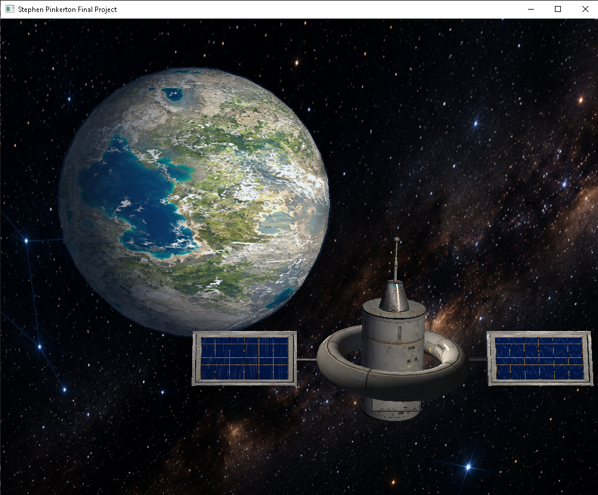

# CS 330: Computational Graphics and Visualization

## Project Overview

For my CS 330 final project, I developed an interactive 3D space scene using C++ and OpenGL. The scene features a space station orbiting a textured planet against a starfield background. The station was constructed from multiple primitive meshes and uses textures, materials, multiple light sources, and transformations to create the finished model.

The project was developed throughout the course as I learned and applied techniques involving 3D modeling, transformations, texture mapping, lighting, camera navigation, and perspective and orthographic projection.

## Project Preview

## Project Features

* 3D space station constructed from multiple primitive meshes
* Textured spacecraft components, solar panels, planet, and starfield
* Multiple light sources with diffuse and specular material properties
* Interactive camera navigation using the keyboard and mouse
* W, A, S, and D movement with Q and E vertical movement
* Mouse-controlled camera orientation
* Adjustable camera movement speed using the mouse scroll wheel
* Perspective and orthographic projection modes
* Optimized mesh complexity while maintaining visual quality

## Repository Contents

### Final 3D Scene

The Final 3D Scene ZIP archive contains the completed C++ and OpenGL project, including the source code, Visual Studio project files, textures, shaders, and other resources required for the scene. Generated Visual Studio cache, debugging, and intermediate build files have been excluded from the portfolio archive.

### Design Decisions

The Design Decisions document explains the major choices made while developing the scene, including modeling, textures, lighting, navigation, code organization, and the iterative development process.

## Reflection

### How do I approach designing software?

This project helped me understand the importance of breaking a larger design into smaller and more manageable pieces. Instead of trying to create the space station as one complex object, I constructed it from basic 3D shapes such as cylinders, rectangular prisms, a torus, and a sphere. I followed an iterative design process where I would add or modify one part of the scene, run the program, evaluate the result, and make adjustments. This was especially useful when working with object placement, scale, textures, lighting, and the overall composition of the scene.

One of the biggest lessons I learned was that the first solution does not always need to be the final one. The background, planet placement, solar panels, lighting, and other parts of the scene went through multiple revisions before I was satisfied with them. I can apply this same approach to future projects by breaking larger problems into smaller components, testing changes frequently, and being willing to revise a design when a different approach produces a better result.

### How do I approach developing programs?

Working on the 3D scene gave me more experience developing a program incrementally instead of trying to implement everything at once. Each milestone introduced additional functionality, allowing me to build on working code as the project became more complex. I used reusable functions from the course framework while customizing the scene rendering, textures, lighting, and camera controls for my project. Keeping responsibilities such as scene preparation, rendering, and user input separated also made the code easier to understand and troubleshoot.

Iteration was a major part of my development process. Many changes required testing the program visually and then adjusting values until the result looked correct. Texture scaling and orientation, lighting intensity, camera position, object transformations, and even polygon counts required experimentation. By the end of the course, I had become more comfortable making smaller controlled changes, testing them, and using the results to determine what needed to be changed next instead of making many changes at once.

### How can computer science help me in reaching my goals?

Computational graphics gave me experience with concepts that I had not worked with extensively before this course, including 3D coordinate systems, transformations, textures, lighting, shaders, camera movement, and perspective and orthographic projection. It also gave me a better understanding of how mathematics and programming work together to produce something visual and interactive. These skills will be useful as I continue my education because they expand my understanding of how software can represent and manipulate information beyond traditional text-based applications.

Professionally, this course strengthened skills that apply beyond graphics programming. Building the final scene required problem solving, debugging, organization, optimization, and repeated testing. It also required me to take a visual goal and determine how to represent it through code. Even if my future work does not focus specifically on computer graphics, the experience of breaking down a complex problem, developing it incrementally, and improving it through iteration is something I can apply to many areas of software development.
